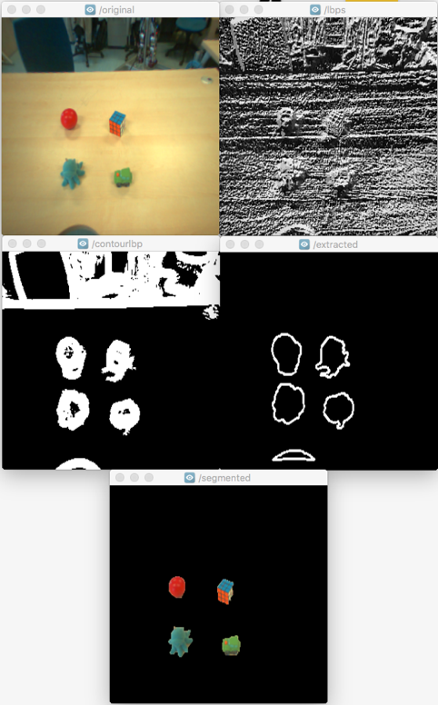

#HSLIDE

### Robot vision tutorial with OpenCV
#VSLIDE
### Typical use of Vision on the iCub + R1

#HSLIDE?image=assets/bg.jpg

#VSLIDE
### Robot vision tutorial with OpenCV
### Part One
#### Find Wally

#VSLIDE
### Goals of this Tutorial
 - find Wally :-)
 - integrating YARP with OpenCV
 - yarp::os::RFModule
 - Thrift services
 - performing simple image processing operations

#HSLIDE

The End :)
